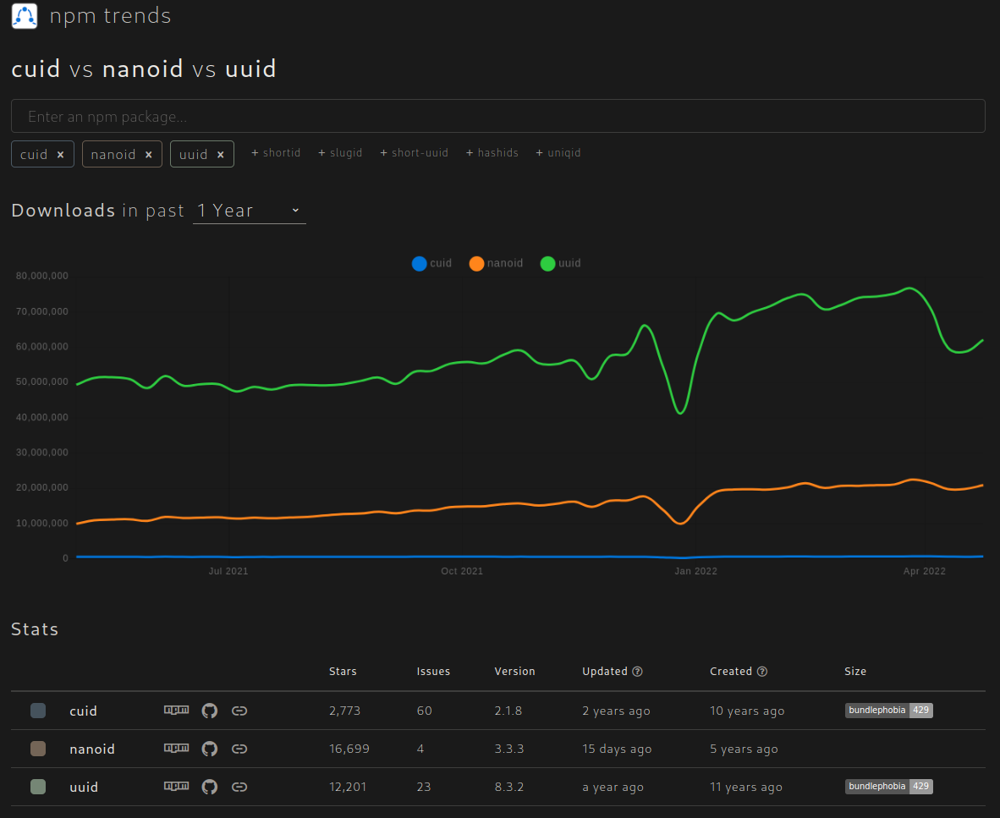

# Laravel Model UUIDs

## Introduction

Huge thanks to Micheal Dyrynda, whose work inspired me to create this package based on [laravel-model-nanoid](https://github.com/michaeldyrynda/laravel-model-nanoid) but uses NanoId instead of UUID.

## Why NanoID?




A tiny, secure, URL-friendly, unique string ID generator for PHP.

This package is PHP implementation of [ai's](https://github.com/ai) [nanoId](https://github.com/ai/nanoid).
Read its documentation for more information.

-   **Fast.** It is faster than NanoID.
-   **Safe.** It uses cryptographically strong random APIs. Can be used in clusters.
-   **Compact.** It uses a larger alphabet than NanoID (`A-Za-z0-9_-`). So ID size was reduced from 36 to 21 symbols.
-   **Customizable.** Size, alphabet and Random Bytes Generator may be overridden.

> **Note**: this package explicitly does not disable auto-incrementing on your Eloquent models. In terms of database indexing, it is generally more efficient to use auto-incrementing integers for your internal querying. Indexing your `nanoId` column will make lookups against that column fast, without impacting queries between related models.

## Installation

This package is installed via [Composer](https://getcomposer.org/). To install, run the following command.

```bash
composer require parables/laravel-model-nanoid
```

## Code Samples

In order to use this package, you simply need to import and use the trait within your Eloquent models.

```php
<?php

namespace App;

use Illuminate\Database\Eloquent\Model;
use Parables\NanoId\GeneratesNanoId;

class Post extends Model
{
    use GeneratesNanoId;
}
```

It is assumed that you already have a field named `nanoId` in your database, which is used to store the generated value. If you wish to use a custom column name, for example if you want your primary `id` column to be a `NanoID`, you can define a `nanoIdColumn` method in your model.

```php
class Post extends Model
{
    public function nanoIdColumn(): string
    {
        return 'id';
    }
}
```

## Use NanoId as primary key

If you choose to use a NanoID as your primary model key (`id`), then use `GeneratesNanoIdAsPrimaryKey` trait on your model.

```php
<?php

namespace App;

use Parables\NanoId\NanoIdAsPrimaryKey;
use Illuminate\Database\Eloquent\Model;

class Post extends Model
{
    use NanoIdAsPrimaryKey;
}
```

And update your migrations

```diff
 Schema::create('users', function (Blueprint $table) {
-     $table->id();
+     $table->string('id')->primary();
 });
```

This trait also provides a query scope which will allow you to easily find your records based on their NanoID, and respects any custom field name you choose.

```php
// Find a specific post with the default (nanoId) column name
$post = Post::whereNanoId($nanoId)->first();

// Find multiple posts with the default (nanoId) column name
$post = Post::whereNanoId([$first, $second])->get();

// Find a specific post with a custom column name
$post = Post::whereNanoId($nanoId, 'custom_column')->first();

// Find multiple posts with a custom column name
$post = Post::whereNanoId([$first, $second], 'custom_column')->get();
```

## Route model binding

Should you wish to leverage implicit route model binding on your `nanoId` field, you may use the `BindsOnNanoId` trait, which will use the value returned by `nanoIdColumn()`. Should you require additional control over the binding, you may override the `getRouteKeyName` method directly.

```php
public function getRouteKeyName(): string
{
    return 'nanoId';
}
```

You can generate multiple NanoID columns for a model by returning an array of column names in the `nanoIdColumns()` method.

If you use the `nanoIdColumns()` method, then **first** element in the array must be the value returned by the `nanoIdColumn()` method which by default is `nanoId`. If you overwrite the `nanoIdColumn()` method, put its return value as the **first** element in the `nanoIdColumns()` return array.

When querying using the `whereNanoId()` scope, the default column - specified by `nanoIdColumn()` will be used.

```php
class Post extends Model
{
    public function nanoIdColumns(): array
    {
        return ['nanoId', 'custom_column'];
    }
}
```

The `nanoIdColumns` must return an array. You can customize the generated `NanoId` for each column by using an associative array where the key is the column name and the value is an array with an optional int `size` and string `alphabet` keys.

```php
  public function nanoIdColumns(): array
    {
        // Option 1: array of column names: this will use the default size and alphabets
        return ['nanoId', 'custom_column'];

        // Option 2: an array where each element is an array with a required 'key' property.
        // no id will be generated if key is null. 'size' and 'alphabet' properties are optional
        return [
            ['key'=>'nanoId'], // use the NanoId::SIZE_DEFAULT = 21; and NanoId::ALPHABET_DEFAULT
            ['key'=>'column_one', 'size' => 6, 'alphabets'=> NanoId::ALPHABET_NUMBERS],
            ['key'=>'column_two', 'size' => 10, 'alphabets'=> NanoId::ALPHABET_UUID],
        ];

          // Option 3: an array with a string key and an array value with an optional 'size' and 'alphabet' property. If a 'key' is passed in the value, it overwrites the original array 'key'.
        return [
            ['key'=>'nanoId'], // use the NanoId::SIZE_DEFAULT = 21; and NanoId::ALPHABET_DEFAULT
            'column_one' => ['size' => 6, 'alphabets'=> NanoId::ALPHABET_NUMBERS],
            // will use 'another_column' as the column name instead of 'column_two'
            'column_two' => ['key'=>'another_column', 'size' => 10, 'alphabets'=> NanoId::ALPHABET_UUID],
        ];
    }
```

The following options are available for the alphabet key.

```php
    NanoId::ALPHABET_DEFAULT => '0123456789abcdefghijklmnopqrstuvwxyzABCDEFGHIJKLMNOPQRSTUVWXYZ-_'
    NanoId::ALPHABET_NUMBERS =>'0123456789'NanoId::ALPHABET_NUMBERS_READABLE => '346789'
    NanoId::ALPHABET_LOWERCASE => 'abcdefghijklmnopqrstuvwxyz'
    NanoId::ALPHABET_LOWERCASE_READABLE => 'abcdefghijkmnpqrtwxyz'
    NanoId::ALPHABET_UPPERCASE => 'ABCDEFGHIJKLMNOPQRSTUVWXYZ'
    NanoId::ALPHABET_UPPERCASE_READABLE => 'ABCDEFGHIJKMNPQRTWXYZ'
    NanoId::ALPHABET_ALPHA_NUMERIC => '0123456789abcdefghijklmnopqrstuvwxyzABCDEFGHIJKLMNOPQRSTUVWXYZ'
            // Numbers and English alphabet without unreadable letters: 1, l, I, 0, O, o, u, v, 5, S, s, 2, Z
    NanoId::ALPHABET_ALPHA_NUMERIC_READABLE => '346789abcdefghijkmnpqrtwxyzABCDEFGHJKLMNPQRTUVWXY'
            // Same as ALPHABET_ALPHA_NUMERIC_READABLE but with removed vowels and following letters: 3, 4, x, X, V.
    NanoId::ALPHABET_ALPHA_NUMERIC_READABLE_SAFE => '6789bcdfghjkmnpqrtwzBCDFGHJKLMNPQRTW'
    NanoId::ALPHABET_UUID => '0123456789abcdef'
```

## Support

If you are having general issues with this package, feel free to contact me on [Twitter](https://twitter.com/pboltnoel).

If you believe you have found an issue, please report it using the [GitHub issue tracker](https://github.com/Parables/laravel-model-nanoid/issues), or better yet, fork the repository and submit a pull request.

If you're using this package, I'd love to hear your thoughts. Thanks!

## Treeware

You're free to use this package, but if it makes it to your production environment you are required to buy the world a tree.

It’s now common knowledge that one of the best tools to tackle the climate crisis and keep our temperatures from rising above 1.5C is to plant trees. If you support this package and contribute to the Treeware forest you’ll be creating employment for local families and restoring wildlife habitats.

You can buy trees [here](https://plant.treeware.earth/michaeldyrynda/laravel-model-nanoid)

Read more about Treeware at [treeware.earth](https://treeware.earth)

## Tools

-   [ID size calculator](https://github.com/CyberAP/nanoid-dictionary) shows collision probability when adjusting the ID alphabet or size.

## Credits

-   Andrey Sitnik [ai](https://github.com/ai) for [Nano ID](https://github.com/ai/nanoid).
-   Michael Dyrynda [michaeldyrynda](https://github.com/michaeldyrynda) for [laravel-model-uuid](https://github.com/michaeldyrynda/laravel-model-uuid).
-   Stanislav Lashmanov [CyberAP](https://github.com/CyberAP) for [Predefined character sets to use with Nano ID](https://github.com/CyberAP/nanoid-dictionary).
